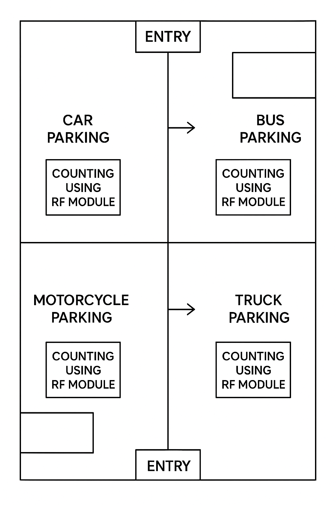

# 🚗 Smart Parking Assistance System

**CDAC Final Project Submission**

---

🎥 Demo Video

## 🧾 Abstract

The **Smart Parking Assistance System** aims to automate parking management by detecting vehicle presence, displaying available slots, and controlling a servo-operated barrier for smooth vehicle entry and exit.  
The system uses **STM32 microcontroller**, **IR sensors**, and **IoT integration** to provide **real-time parking updates** for both cars and buses, enhancing convenience and reducing human effort.

---

## 🎯 Objectives

- To detect vehicle presence using IR sensors.  
- To control a servo barrier for vehicle entry.  
- To display available parking slots on an LCD.  
- To upload parking status to an IoT server in real-time.  
- To develop a reliable and scalable parking management system.

---

## 🧠 System Overview

| Component  | Description |
|------------|-------------|
| **Microcontroller** | STM32F407 (ARM Cortex-M3) |
| **Sensors** | IR sensors for slot detection |
| **Actuator** | Servo motor for barrier control |
| **Display** | 16x2 LCD module | 20x4 LCD module |
| **Connectivity** | ESP8266 WiFi module |
| **Software Tools** | STM32CubeIDE, ThingSpeak ,ArduinoIDE |

---

## 🧩 Block Diagram

## 🧩 connection 
.jpeg)

        
